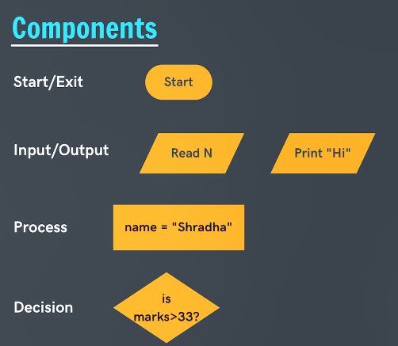

# FLOWCHARTS AND PSEUDOCODES

### _**Flowcharts**_
- Logic Building
- Diagram to represent solutions of problems
- Breaking down the problem into pieces
- Ex: {Start} => [Step 1: problem piece 1] => [Step 2: problem piece 2] => {Exit}

- Arrange the pieces into systematical and logical order.

- Components of the Flowchart:
    - Start/Exit
    - Input/Output
    - Process
    - Decision
    - Arrows (to describe where the flow is going)
    - Components 
    

- All these above steps combine to form what is known as a Pseudo Code

- Pseudocodes: are step by step procedures to understand the flow of the program and what steps to take.

### _**Pseudocodes**_

Problems to understand flowchart and making pseudocodes

1. Sum of 2 Nums
**_flowchart_**
- [x] Start
- [x] Input
    - first num a
    - second num b
- [x] Process
    - sum = a + b
- [x] Output
    - print sum
- [x] Exit

**_pseudocode_**
    1. start
    2. input nums a & b
    3. calculate sum = a + b
    4. print sum
    5. exit

2. Calculate Simple Interest
**_flowchart_**
- [x] Start
- [x] Input
    - Principal Amount (P)
    - Rate (R)
    - Time (T)
- [x] Process
    - SI = (P x R x T)/100
- [x] Output
    - print SI
- [x] Exit

**_pseudocode_**
    1. start
    2. input values of Principal Amount, Rate and Time
    3. calculate SI = (P x R x T)/100
    4. print SI
    5. exit

3. Max of 3 Numbers
**_flowchart_**
- [x] Start
- [x] Input
    - num a
    - num b
    - num c
- [x] Decision
    - is a > b
        - if YES
            - is a > c
                - if YES
                    - print a
                - if NO
                    - print c
        - if NO
            - is b > c
                - if YES
                    - print b
                - if NO
                    - print c
- [x] Output
    - print whichever is greater a or b or c
- [x] Exit

**_pseudocode_**
    1. start
    2. input values of a b c
    3. find greater among a b and c
        if a>b do
            if a>c do
                print a
            else
                print c
        else
            if b>c do
                print b
            else
                print c

    4. print Max number
    5. exit

4. Finding Prime Number
**_flowchart_**
- [x] Start
- [x] Input
    - num n
- [x] Process
    - let div = 2
    - while div < n do
        - if n % div == 0 do
            - print Not prime
            - exit
        - else
            - div = div + 1
- [x] Output
    - print prime
- [x] Exit

**_pseudocode_**
    1. start
    2. input num n
    3. let div = 2
        while div < n do
            if n % div == 0 do
                print not prime
            else
                div = div + 1
    4. print prime number
    5. exit

5. Sum of n Natural Numbers
**_flowchart_**
- [x] Start
- [x] Input
    - num n
- [x] Process
    - let val = 1, sum = 0
- [x] Decision
    - val <= n
        - if YES do
            - sum = sum + val
            - val = val + 1
        - if NO do
            - print sum of 1st n natural numbers
- [x] Output
    - print sum of 1st n natural numbers
- [x] Exit

**_pseudocode_**
    1. start
    2. input num n
    3. let val = 1 & sum = 0
        while val <= n do
            sum = sum + val
            val = val + 1
    4. print sum of 1st n natural numbers
    5. exit